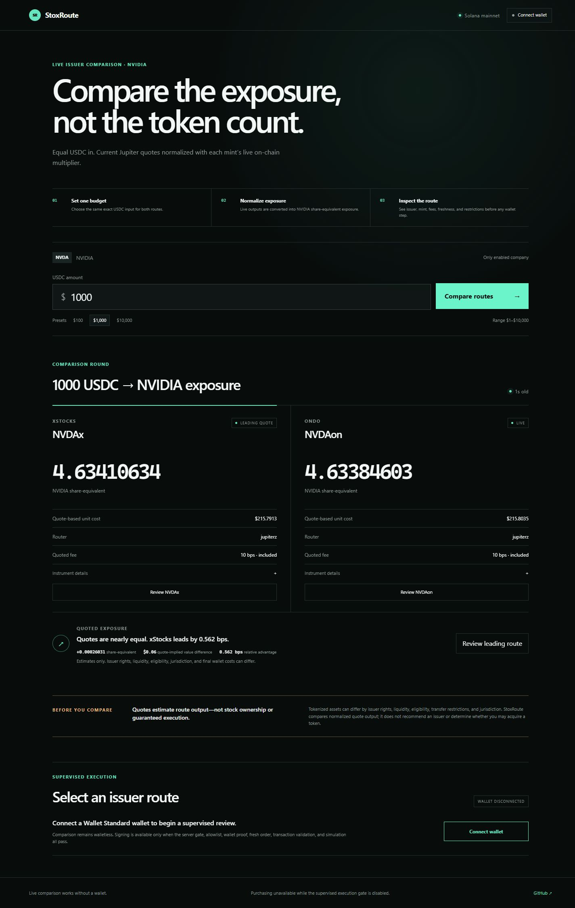
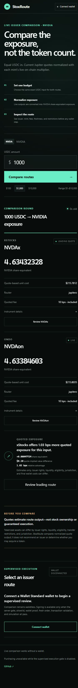

# StoxRoute

**Compare the exposure, not the token count.**

**Live demo:** [stoxroute.vercel.app](https://stoxroute.vercel.app)

StoxRoute compares live Jupiter routes for NVDAx and NVDAon using the same exact USDC input. It normalizes each token output with current onchain Token-2022 Scaled UI state so users can compare NVIDIA share-equivalent exposure rather than misleading raw token quantities. The comparison works without a wallet.



## The problem

Tokenized representations of the same underlying company can use different decimals, multipliers, issuers, fees, and liquidity. A larger raw token count does not necessarily represent more underlying exposure, and matching ISINs do not make instruments legally identical or interchangeable.

## The solution

StoxRoute gives both supported routes one equal USDC budget, fetches them together, reads each mint's current normalization state from Solana, and ranks only a complete and fresh pair by share-equivalent exposure. The result identifies the issuer and token, additional normalized exposure, relative basis-point difference, and a clearly labeled quote-implied value difference.

The current scope is deliberately narrow: NVIDIA, NVDAx, NVDAon, USDC, Jupiter Swap V2, and Solana mainnet.

## Verified functionality

- Live walletless comparison of NVDAx and NVDAon for `$1`–`$10,000` USDC.
- Exact decimal conversion and BigInt-safe base-unit handling.
- Current Token-2022 Scaled UI multiplier resolution at a shared confirmed slot.
- Concurrent Jupiter Swap V2 routes with freshness, response-skew, partial, throttle, malformed-response, and stale-state handling.
- Honest complete-pair ranking; a single available route never becomes a winner.
- Wallet Standard discovery through Solana Wallet Adapter, including Phantom when installed.
- Server-disabled supervised execution path with wallet proof, optional allowlist, fresh taker order, signed intent binding, decoded transaction validation, simulation, and confirmed-chain receipt accounting.
- 40 domain, HTTP-boundary, and execution-boundary tests, production build, and desktop/mobile browser verification.

No live transaction has been signed, submitted, or confirmed. Execution remains disabled pending an independently eligible tester and live mainnet verification.

## Product walkthrough

1. Open the app without connecting a wallet.
2. Keep NVIDIA selected and choose a USDC preset or enter an exact amount.
3. Select **Compare routes**. Both issuer routes refresh as one comparison round.
4. Read the leading quote, normalized exposure difference, quote-implied value difference, and basis-point advantage.
5. Expand **Instrument details** to inspect mint, raw output, multiplier, router, fee facts, and quote time.
6. Select either issuer for review. With the default server configuration, purchasing remains visibly unavailable.

The display expires after 15 seconds. Refresh both routes before treating a result as current.

## Architecture

| Layer | Responsibility |
|---|---|
| Next.js App Router | Single responsive comparison application and server-only API boundary |
| Solana JSON-RPC | Confirmed mint state, chain time, simulation, and confirmed transaction metadata |
| Jupiter Swap V2 | Walletless comparison orders plus gated taker-specific order/execute flow |
| `decimal.js` + BigInt | Precise normalization and integer base-unit handling |
| Wallet Adapter | Wallet Standard discovery and browser-side signing only |
| HMAC intent envelopes | Short-lived binding of wallet, issuer, amount, quote IDs, expiry, and transaction message |

The core calculation is:

```text
token units = output base units / 10^mint decimals
share-equivalent exposure = token units × active onchain multiplier
```

Historical evidence under `docs/evidence/` and `research/` is never used as a runtime fallback.

## Safety model

- `EXECUTION_ENABLED=false` blocks preparation on the server even if the UI is bypassed.
- Execution mutations require the configured application origin and a signed wallet challenge.
- A configured wallet allowlist is enforced server-side.
- Every order refreshes mint state and requires exact input mint, output mint, amount, taker, issuer, and symbol matches.
- The decoded transaction must contain the reviewed wallet signer and mints and pass simulation.
- Submission requires the unchanged reviewed message and a valid Ed25519 wallet signature.
- A receipt is confirmed only from positive onchain wallet USDC debit and selected-token credit deltas.
- The application never asks for or handles seed phrases or private keys.
- JSON APIs enforce their actual streamed-body size and media type rather than trusting `Content-Length`.
- Production responses set CSP, anti-framing, MIME-sniffing, referrer, permissions, opener, and HSTS headers.
- The public quote endpoint has a small process-local burst limit; provider throttling remains authoritative across serverless instances.

These controls are not legal or eligibility approval. Tokenized assets can have issuer, liquidity, transfer, eligibility, and jurisdiction restrictions.

## Local setup

Requirements: Node.js 24.x and npm 11.x were used for the verified build.

```powershell
git clone https://github.com/trevor-dev-johnson/stoxroute.git
Set-Location stoxroute
Copy-Item .env.example .env.local
npm install
npm run dev
```

Open `http://localhost:3000`. Quote mode works with the defaults and does not require a wallet.

## Environment variables

| Variable | Scope | Purpose |
|---|---|---|
| `SOLANA_RPC_URL` | Server | Confirmed mint reads, simulation, and receipts |
| `NEXT_PUBLIC_SOLANA_RPC_URL` | Public client | Wallet Adapter connection endpoint |
| `NEXT_PUBLIC_APP_URL` | Public build | Canonical metadata/social-sharing origin |
| `APP_ORIGIN` | Server | Exact allowed origin for execution mutations |
| `JUPITER_API_KEY` | Server | Optional for comparison; required for managed execution |
| `EXECUTION_ENABLED` | Server | Exact `true` enables the supervised execution boundary |
| `EXECUTION_ALLOWED_WALLETS` | Server | Comma-separated approved tester wallets |
| `EXECUTION_INTENT_SECRET` | Server | Random HMAC secret of at least 32 characters |

Never expose the Jupiter key or intent secret in a `NEXT_PUBLIC_` variable. Leave execution disabled unless the documented tester gate is satisfied.

## Verification

```powershell
npm run typecheck
npm run lint
npm test
npm run build
```

The repository additionally uses staged secret-pattern and sensitive-filename checks before release. Current production-dependency audit output includes 12 moderate transitive advisories in the Solana wallet/web3 dependency tree without a compatible automatic fix; avoid forcing a breaking upgrade during the sprint.

## Demo guidance

Use a fresh browser session, keep execution disabled, run the `$1,000` comparison, explain the three verdict numbers, expand one instrument, and select the leading route. Say explicitly that the figures are current quote estimates and that the purchase path is implemented but not live-verified. See [the submission copy and 60–90 second script](docs/SUBMISSION.md).



## Limitations

- NVIDIA is the only enabled company.
- Only NVDAx and NVDAon are compared.
- Quote ranking does not assess issuer quality or legal equivalence.
- Quote-implied value difference is an explanatory estimate, not realized savings.
- Public RPC and provider rate limits can temporarily prevent a complete comparison.
- The public deployment uses default public Solana RPC/provider access, so shared-demo reliability is subject to upstream limits until dedicated credentials are configured.
- No eligible tester transaction or confirmed receipt has been verified yet.

## Roadmap

1. Configure a reliable server RPC and optional Jupiter key for the public deployment.
2. Complete one independently eligible, smallest-meaningful-amount supervised mainnet verification.
3. Record actual fee/debit semantics and confirmed receipt evidence.
4. Revalidate Tesla/SPY only after the core submission is complete.

## Sources and credits

Solana supplies the chain and Token-2022 infrastructure; Jupiter supplies routing and managed execution; xStocks and Ondo supply the compared instruments and issuer data. Core open-source dependencies include Next.js, React, Solana Web3.js, Solana Wallet Adapter, Decimal.js, Zod, TweetNaCl, and Vitest. See `package.json` and `package-lock.json` for exact versions.
